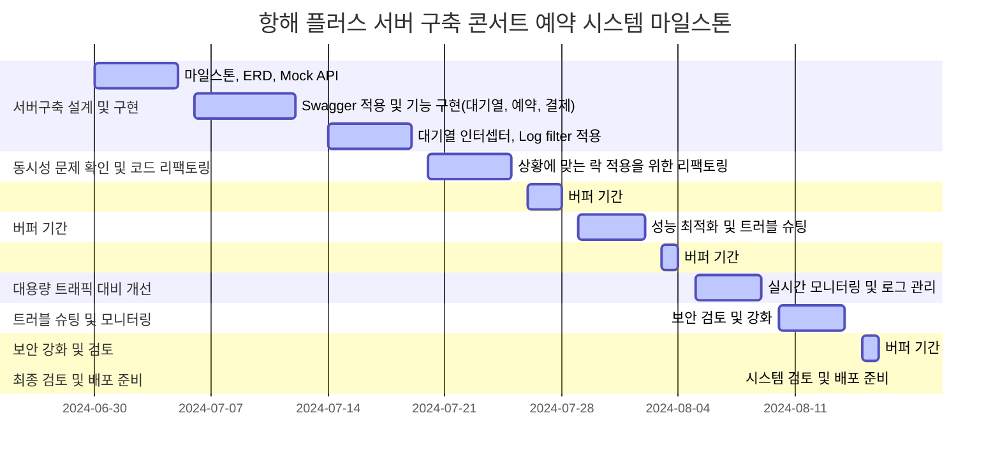

# 콘서트 예약 서비스

- 클린 아키텍처와 TDD를 적용한 콘서트 예약 서비스를 개발합니다.
- 동시성 제어, Redis를 이용한 캐쉬 및 대기열 처리 
- Kafka를 이용한 이벤트 스트리밍 기반 ~~  
- 성능 최적화를 위한 인덱스 구성 및 부하테스트 

## Description

- **`콘서트 예약 서비스`** 를 구현해 봅니다.
- 대기열 시스템을 구축하고, 예약 서비스는 작업가능한 유저만 수행할 수 있도록 해야합니다.
- 사용자는 좌석예약 시에 미리 충전한 잔액을 이용합니다.
- 좌석 예약 요청시에, 결제가 이루어지지 않더라도 일정 시간동안 다른 유저가 해당 좌석에 접근할 수 없도록 합니다.

## Requirements

- 아래 5가지 API 를 구현합니다.
  - 유저 토큰 발급 API
  - 예약 가능 날짜 / 좌석 API
  - 좌석 예약 요청 API
  - 잔액 충전 / 조회 API
  - 결제 API
- 각 기능 및 제약사항에 대해 단위 테스트를 반드시 하나 이상 작성하도록 합니다.
- 다수의 인스턴스로 어플리케이션이 동작하더라도 기능에 문제가 없도록 작성하도록 합니다.
- 동시성 이슈를 고려하여 구현합니다.
- 대기열 개념을 고려해 구현합니다.

### 마일스톤




### 시퀀스 다이어그램

### ERD 설계

### API 명세서

### Swagger

### 동시성 분석 및 개선

### Caching 전략 

### Redis를 이용하여 RDB로 구현된 대기열 리팩토링

### 인덱스를 적용한 성능최적화

### 서비스 규모 확장에 따른 Transaction 분리 및 고찰

### Kafka를 이용한 책임분리 및 Transactional Outbox Pattern 구현 보고서

### 부하테스트 및 장애 대응 보고서


<br>


---

### API 명세서 (아래 링크를 클릭해주세요.)

https://first-longan-7e1.notion.site/API-3c9b22117eae4c079f6228051e908ef7?pvs=4

---
### 동시성 이슈 및 제어

> 예약하기 기능의 동시성 이슈 및 제어

동시성 로직 파악
동시성 해결 방법
각 케이스 별로 어떤 락이 맞는지
트랜잭션 위치

- 시나리오 
  - 콘서트 예약시 여러명의 사용자가 복수개의 좌석을 선택하여 예약을 진행합니다.

- 적용한 락 종류
  - `비관적 락`
- 적용 이유
  - 좌석의 경우 많은 사용자가 동시에 점유하는 상황(경쟁 조건 - race condition)이 빈번하게 일어날 수 있으며 또한 좌석을 선점한 상태의 일관성을 유지하기 위해 `비관적 락`을 사용했습니다. 
  
- 적용 위치
  - 선택된 좌석을 점유 상태인지 조회하는 쿼리에서 비관적 락을 사용하였습니다.

```java
@Lock(LockModeType.PESSIMISTIC_READ)
@QueryHints(@QueryHint(name = "jakarta.persistence.lock.timeout", value = "1500"))
@Query("select t from Ticket t where t.id.concertScheduleId = :concertScheduleId and t.id.seatId in :seats")
List<Ticket> findAllWithPessimisticLock(@Param("concertScheduleId") Long concertScheduleId, @Param("seats") List<Long> seats);
```

- 테스트 조건
  - 1000명의 사용자가 동시에 2개의 좌석을 임시 선점하는 시나리오
  - 테스트 실패 (락 미적용)
    - 2개의 동일한 좌석이 7번의 서로 다른 예약에 의해 선점됨
  - 테스트 성공 (비관적락 적용)
    - 2개의 좌석이 하나의 예약으로만 선점됨


<br>


- 성능 테스트

| 사용자수          | 테스트 시간체크     |
|---------------|--------------|
| 1000명 동시성 테스트 | 1sec 277 ms  |
| 10000명 동시성 테스트 | 7sec 133 ms  |
| 20000명 동시성 테스트 | 15sec 797 ms |


<br>

<br>


<br>
<br>

> 포인트 충전 기능의 동시성 이슈 및 제어

- 시나리오
  - 사용자의 실수로 포인트 충전요청이 동시에 여러번 일어난 경우
  - 적용한 락 종류
    - 낙관적 락
  - 적용 이유
    - 빈번하게 일어나는 동시성의 이슈가 아닌 사용자의 실수로 일어나는 오류를 방지하며, <br>Version을 사용해 어플리케이션 상에서 해당 행위를 방지하기 위해 적용했습니다.
  - 적용 위치
    - 토큰을 이용하여 사용자가 가지고 있는 포인트를 조회시 낙관적락을 적용했습니다.
  ```java
    @Lock(LockModeType.OPTIMISTIC)
    @Query("select u from UserAccount u where u.token = :token")
    Optional<UserAccount> findByToken(@Param("token") String token);
  ```
- 테스트 조건
  - 10번의 반복된 포인트 충전 시도 시


   - 트랜잭션의 위치를 서비스가 아닌 리포지토리로 변경시 기존 10번에서 15번까지 테스트 통과


  
  
