# 콘서트 예약 서비스

<details>
    <summary style="font-weight: bold; font-size: 17px;">요구사항</summary>

## Description

- **`콘서트 예약 서비스`** 를 구현해 봅니다.
- 대기열 시스템을 구축하고, 예약 서비스는 작업가능한 유저만 수행할 수 있도록 해야합니다.
- 사용자는 좌석예약 시에 미리 충전한 잔액을 이용합니다.
- 좌석 예약 요청시에, 결제가 이루어지지 않더라도 일정 시간동안 다른 유저가 해당 좌석에 접근할 수 없도록 합니다.

## Requirements

- 아래 5가지 API 를 구현합니다.
  - 유저 토큰 발급 API
  - 예약 가능 날짜 / 좌석 API
  - 좌석 예약 요청 API
  - 잔액 충전 / 조회 API
  - 결제 API
- 각 기능 및 제약사항에 대해 단위 테스트를 반드시 하나 이상 작성하도록 합니다.
- 다수의 인스턴스로 어플리케이션이 동작하더라도 기능에 문제가 없도록 작성하도록 합니다.
- 동시성 이슈를 고려하여 구현합니다.
- 대기열 개념을 고려해 구현합니다.

</details>

<details>
    <summary style="font-weight: bold; font-size: 17px;">마일스톤</summary>

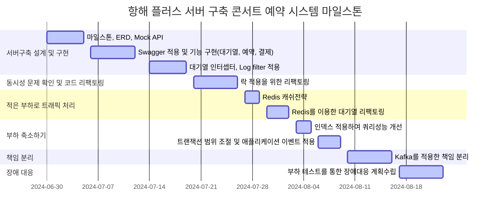
</details>

<details>
    <summary style="font-weight: bold; font-size: 17px;">시퀀스 다이어그램</summary>

#### 콘서트 및 콘서트 스케줄 조회
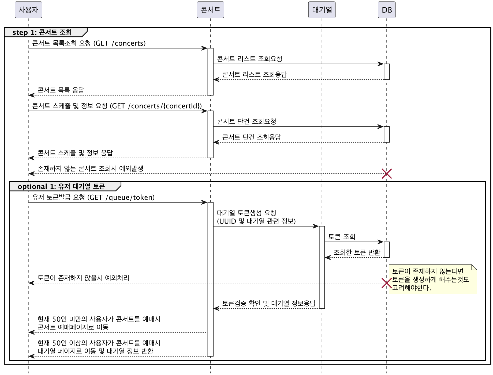

#### 예약가능 날짜 및 좌석 조회, 포인트로 좌석 예약
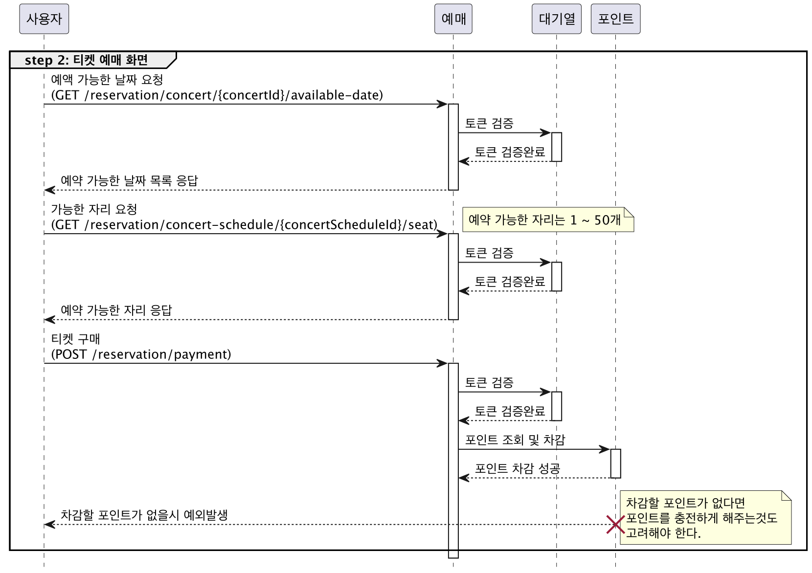

#### 포인트 충전, 사용
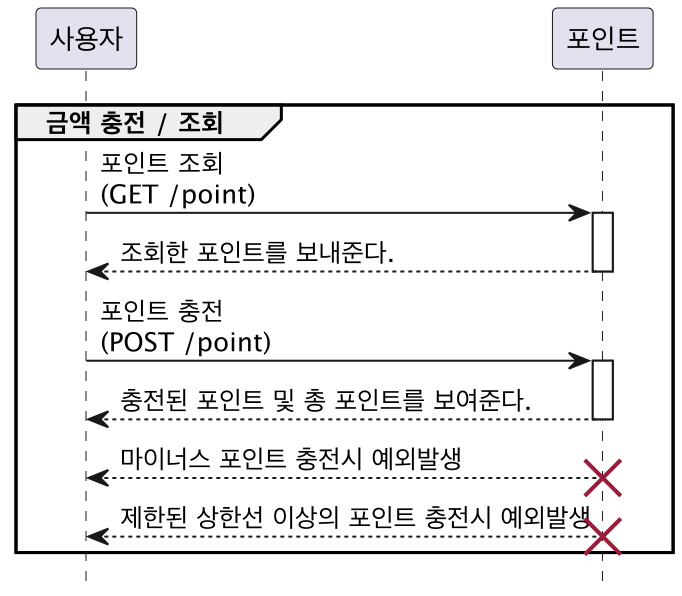

</details>


<details>
    <summary style="font-weight: bold; font-size: 17px;">ERD</summary>

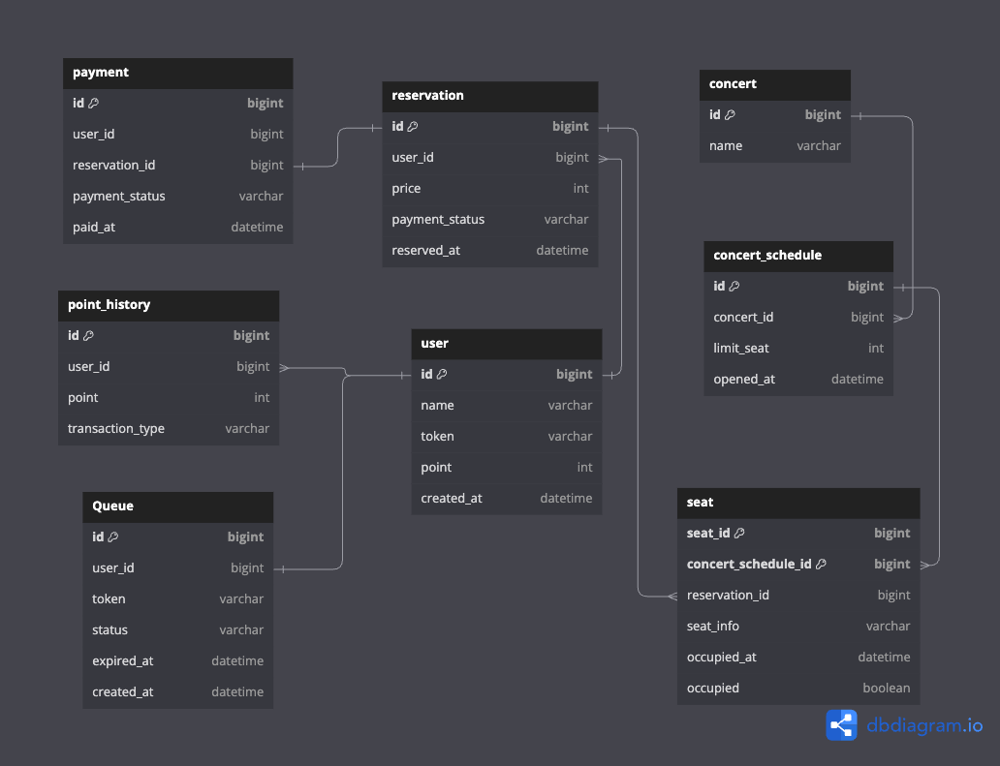

</details>


<details>
    <summary style="font-weight: bold; font-size: 17px;">API 명세서</summary>

### 대기열 토큰 발급 API

Endpoint

```
POST /queue/token
```

Response
```json
Http Status: 200 ok

Body: 
{
  id: 1
  userId : 1
  token: ‘UUID’,
  status: WAIT,
  createdAt: 2024-07-10 10:10:10,
  expiredAt: 2024-07-10. 10:15:10
}
```

### 콘서트 목록조회 API

Endpoint
```
GET /concerts
```

Response
```json
Http Status: 200 ok
        
Body:
  {
      concerts: [ 
         { 
            id: 1,  
           name: ‘콘서트1’
          },
         { 
            id: 2,  
           name: ‘콘서트2’
          }, 
      ]
  }
```

### 콘서트 단일조회 API

Endpoint
```
GET /concert/{concertId}
```

Request Body
```
{
  concertId: 1
} 
```

Response
```json
Http Status: 200 ok

Response Body:
        
  {
    id: 1
    name: ‘콘서트1’
  }
```

### 예약가능 날짜 조회 API

Endpoint
```
GET /concertSchedules/concerts/{cocnertId}
```

Request Body
```
{
  concertId: 1
} 
```

Response
```json

ResponseBody: 
{
    id : 1,
    name: ‘콘서트1’,
    concertSchedules: [
        {
           id: 1,
           openedAt: 2024-02-10 02:30
        },
        {
           id: 2,
           openedAt: 2024-02-15 02:30
        },
        ...
    ]
}
```

### 예약가능 좌석조회 API

EndPoint
```
/concertSchedules/{concertScheduleId}/seats
```

Request Body
```
{
  concertSchedule: 1
}
```

Response
```json
Http Status: 200 ok

Response Body:
{
  seats: [
     {
         id: 2,
         seatId: 3,
         concertScheduleId: 1
         occupied: false
     },
    {
          id: 3,
          seatId: 5,
          concertScheduleId: 1
          occupied: false
    }
   ]
}
```

### 좌석예약 API

Endpoint
```
POST /reservation
```

Request Body
```
{
  concertId: 1
  concertSchedule: 1,
  seatId: [1, 2]
}
```

Response
```
void
(200, SUCCESS)
```

### 결제 API

Endpoint
```
POST /reservation/payment
```

Request Body
```
{
    reservationId: 1,
    amount: 1000
}
```

Response
```
void
(200, SUCCESS)
```

### 포인트 조회

Endpoint
```
GET /point
```

Request Body
```
{
  userId: 1
}
```

Response
```
{
  point: 100
}
```

### 포인트 충전

Endpoint
```
POST /point/charge
```

Request Body
```
{
  point: 1000
}
```

Response
```
void
(200, SUCESS)
```

### API 명세서 정리표(링크)

https://first-longan-7e1.notion.site/API-3c9b22117eae4c079f6228051e908ef7?pvs=4

</details>

<details>
  <summary style="font-weight: bold; font-size: 17px;">Swagger</summary>

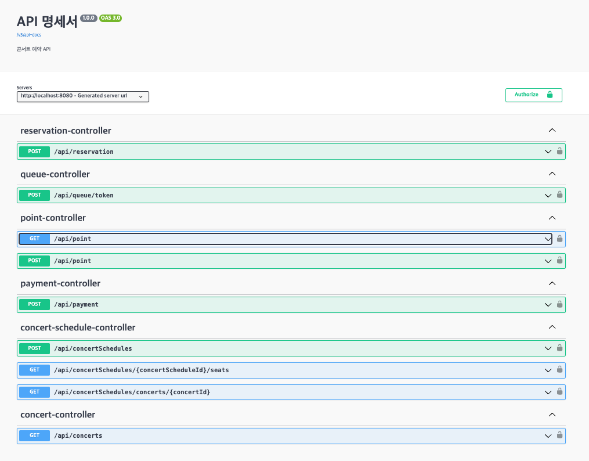

</details>


<details>
  <summary style="font-weight: bold; font-size: 17px;">동시성 분석 및 개선 - 개선</summary>

```
동시성 로직 파악
동시성 해결 방법
각 케이스 별로 어떤 락이 맞는지
트랜잭션 위치
```

> 예약하기 기능의 동시성 이슈 및 제어

- 시나리오
  - 콘서트 예약시 여러명의 사용자가 복수개의 좌석을 선택하여 예약을 진행합니다.

- 적용한 락 종류
  - `비관적 락`
- 적용 이유
  - 좌석의 경우 많은 사용자가 동시에 점유하는 상황(경쟁 조건 - race condition)이 빈번하게 일어날 수 있으며 또한 좌석을 선점한 상태의 일관성을 유지하기 위해 `비관적 락`을 사용했습니다.

- 적용 위치
  - 선택된 좌석을 점유 상태인지 조회하는 쿼리에서 비관적 락을 사용하였습니다.

```java
@Lock(LockModeType.PESSIMISTIC_WRITE)
@QueryHints(@QueryHint(name = "jakarta.persistence.lock.timeout", value = "1500"))
@Query("select t from Ticket t where t.id.concertScheduleId = :concertScheduleId and t.id.seatId in :seats")
List<Ticket> findAllWithPessimisticLock(@Param("concertScheduleId") Long concertScheduleId, @Param("seats") List<Long> seats);
```

- 테스트 조건
  - 1000명의 사용자가 동시에 2개의 좌석을 임시 선점하는 시나리오
  - 테스트 실패 (락 미적용)
    - 2개의 동일한 좌석이 7번의 서로 다른 예약에 의해 선점됨
  - 테스트 성공 (비관적락 적용)
    - 2개의 좌석이 하나의 예약으로만 선점됨

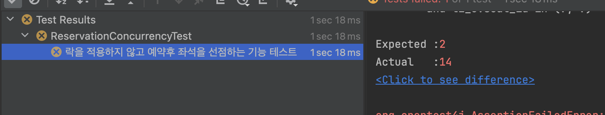

<br>

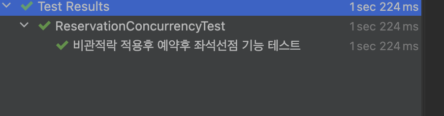

- 성능 테스트

| 사용자수          | 테스트 시간체크     |
|---------------|--------------|
| 1000명 동시성 테스트 | 1sec 277 ms  |
| 10000명 동시성 테스트 | 7sec 133 ms  |
| 20000명 동시성 테스트 | 15sec 797 ms |

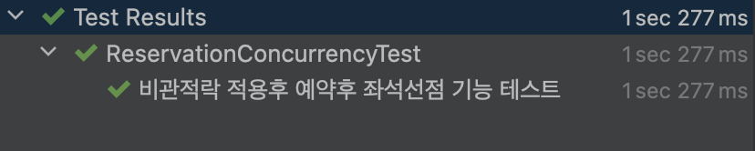
<br>
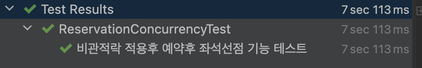
<br>
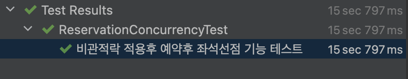

<br>
<br>

> 포인트 충전 기능의 동시성 이슈 및 제어

- 시나리오
  - 사용자의 실수로 포인트 충전요청이 동시에 여러번 일어난 경우
  - 적용한 락 종류
    - 낙관적 락
  - 적용 이유
    - 빈번하게 일어나는 동시성의 이슈가 아닌 사용자의 실수로 일어나는 오류를 방지하며, <br>Version을 사용해 어플리케이션 상에서 해당 행위를 방지하기 위해 적용했습니다.
  - 적용 위치
    - 토큰을 이용하여 사용자가 가지고 있는 포인트를 조회시 낙관적락을 적용했습니다.
  ```java
    @Lock(LockModeType.OPTIMISTIC)
    @Query("select u from UserAccount u where u.token = :token")
    Optional<UserAccount> findByToken(@Param("token") String token);
  ```
- 테스트 조건
  - 10번의 반복된 포인트 충전 시도 시

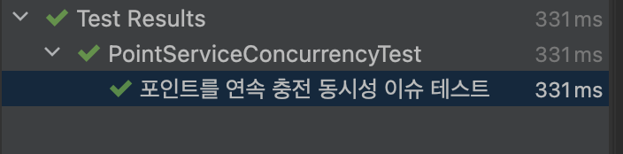

- 트랜잭션의 위치를 서비스가 아닌 리포지토리로 변경시 기존 10번에서 15번까지 테스트 통과

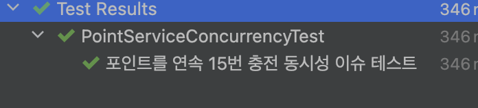

</details>


<details>
  <summary style="font-weight: bold; font-size: 17px;">Caching 전략 - 생성</summary>

</details>


<details>
  <summary style="font-weight: bold; font-size: 17px;">Redis를 이용한 대기열 리팩토링</summary>

### 목적

기존의 데이터베이스로 관리하던 대기열 시스템을 Redis를 이용하여 데이터베이스의 부하를 줄인다.

### 대기열과 개발방식 고찰

#### 은행창구 방식
- 만료된 대기열의 큐만큼 서비스를 이용할 수 있는 토큰을 활성화
- 현재 대기열은 데이터베이스를 이용하여 은행 창구 방식으로 관리된다.
- 대기열 시스템을 요약하자면 아래와 같다.
  1. 콘서트 스케줄 날짜 조회를 시도하는 사용자에게 토큰을 발급하고 데이터베이스에 저장한다. 토큰의 상태값은 `WAIT`이다.
  2. 만료된 토큰을 기준으로 스케줄러를 이용하여 일정시간마다 `WAIT`의 토큰을 `ACTIVE`로 변경한다. (만료시간은 5분 - 평균 유저활동 시간)
  3. 5분 내에 콘서트 예약이 이루어지지 않는다면 스케줄러를 이용하여 `ACTIVE`에서 `EXPIRE`로 변경한다.
  4. 예약이 완료된다면 `ACTIVE`에서 `EXPIRE`로 변경한다.
- 장점
  - 서비스를 이용하는 유저를 일정한 수 만큼 유지할 수 있다.
- 단점
  - 유저의 행동에 따라 대기열의 전환시간이 불규칙하다.
#### 놀이공원 방식
- N초마다 M개의 Active token으로 전환한다.
- Redis를 이용하여 개선될 방식이다.
- 장점
  - 대기열의 사용자들이 일정한 시간으로 서비스의 진입이 가능하다.
- 단점
  - 서비스를 이용하는 사용자의 수가 보장되지 않는다.

#### 대기열 기능개발
- RDB에서 관리하던 기존 대기열을 아래의 Redis 자료구조를 이용하여 처리함
  - 기존
    - 데이터베이스를 이용한 대기열 관리
  - 신규
    - 2가지 Redis 자료구조를 이용하여 대기열을 구성함
    - 대기큐(WaitingQueue) : Sorted Set 자료구조를 이용
    - 활성큐(ActiveQueue) : Set 자료구조 이용
- 큐의 만료시간 설정
  - 기존 : 스케줄러를 이용하여 5분경과된 데이터의 상태값 변경
  - 신규 : 활성큐의 Key에 TTL을 적용하여 만료시간을 조절
- 만료시간 연장
  - 기존 : 토큰을 이용하여 해당 큐를 조회하여 만료시간을 연장함
  - 신규 : 토큰을 이용하여 해당 큐의 TTL을 갱신

### 코드

```java
@Service
@RequiredArgsConstructor
public class QueueRedisService {

    private final UserAccountRepository userAccountRepository;

    private final WaitingQueueRedisRepository waitingQueueRedisRepository;
    private final ActiveQueueRedisRepository activeQueueRedisRepository;

    /**
        대기큐 생성
    */
    public String createWaitQueue(Long userId) {
        String lockKey = "lock:user:" + userId;
        // 10초동안 같은 유저가 큐에 진입하지 못하도록 함
        Boolean isUserQueued = redisTemplate.opsForValue()
                .setIfAbsent(lockKey, "LOCK:%d".formatted(userId), 10, TimeUnit.SECONDS);

        if (Boolean.FALSE.equals(isUserQueued)) {
            String s = redisTemplate.opsForValue().get(lockKey);
            log.error("user already in the wait Queue : userId - {}, lockValue - {}", userId, s);
            return "";
        }

        try {
            UserAccount userAccount = userAccountRepository.findById(userId);
            String token = generateToken();
            // 생성된 토큰을 사용자 정보에 저장
            userAccount.saveToken(token);
            userAccountRepository.save(userAccount);
            // 대기열에 사용자의 정보와 토큰을 저장
            waitingQueueRedisRepository.save(userAccount.getId(), token);
            return token;
        } finally {
            redisTemplate.delete(lockKey);
        }
    }

    /**
        활성큐('Active Queue')를 생성한다.
            - 놀이공원 방식의 `대기열`을 구성
            - 파라미터(limit)만큼의 큐를 `대기큐`에서 `활성큐`로 변경
            - 스케줄러를 사용하여 변경함
    */
    public void createActiveQueue(int limit) {
        Set<WaitingQueueRedisDto> waitingQueues = waitingQueueRedisRepository.getQueueByRange(limit);
        waitingQueues.forEach(dto -> {
            activeQueueRedisRepository.save(dto.getToken(), dto.getUserId());
            waitingQueueRedisRepository.remove(dto.getToken(), dto.getUserId());
        });
    }

    /**
        활성큐의 만료시간을 연장한다.
     */
    public void extendExpiration(String token) {
        activeQueueRedisRepository.extendExpiration(token);
    }

    /**
        대기큐의 순위를 리턴한다. - 사용자의 접속 순서를 확인할 수 있음
     */
    public Long getRank(String token, Long userId) {
        return waitingQueueRedisRepository.getRank(token, userId);
    }

    /**
        활성큐를 검증한다.
     */
    public boolean verify(String token) {
        return activeQueueRedisRepository.verify(token);
    }

    /**
        파라미터 범위만큼 대기큐를 조회한다.
     */
    public Set<WaitingQueueRedisDto> getWaitingQueues(int limit) {
        return waitingQueueRedisRepository.getQueueByRange(limit);
    }

    private String generateToken() {
        String uuid = UUID.randomUUID().toString();
        return uuid.substring(uuid.lastIndexOf("-") + 1);
    }
}
```
---
### 부하테스트

#### 목적

부하테스트를 실시하여 대기열에서 처리열로 이동할 수 있는 토큰의 수량 및 시간을 특정할 수 있다.

#### 테스트 환경

- 서버: 로컬 테스트
  - 사양: Mac CPU(M3) , RAM(18G)
- 데이터베이스 : MySql (Server version: `8.3.0` MySQL Community Server - GPL)
- Redis: redis_version: `6.2.14`
- 부하테스트 : `k6`

#### 테스트 시나리오 및 결과

> 1. 30초 동안 점진적으로 사용자를 1명에서 1000명의 늘린다.
> 2. 30초 동안 1000명의 사용자를 유지한다.
> 3. 30초 동안 점진적으로 사용자를 1000명에서 1명으로 줄인다.


테스트 결과
- 평균: 7.99ms
- 최대: 86.06ms
- 평균 TPS: 660/s

1분간 유저가 호출하는 API
- 2(콘서트 좌석을 조회하는 API, 예약 API) * 1.5 ( 동시성 이슈에 의해 예약에 실패하는 케이스를 위한 재시도 계수(예측치)) = 3

분당 처리할 수 있는 트랜잭션 수: 660/s * 60s = 39600

분당 처리할 수 있는 동시 접속자 수: 39600 / 3(API 수) = 13200 명

데스트 서버를 이용시 `1분당` 대략적으로 `13200명`을 동시 처리가능하므로 `10초`마다 `2200명`의 토큰을 대기큐에서 활성큐로 전환하여 수용할 수 있다는 추론이 나온다.


</details>

<details>
  <summary style="font-weight: bold; font-size: 17px;">인덱스를 적용한 성능최적화 - 추가</summary>

<br>

> 제공되는 서비스의 요구사항 중 쿼리의 성능을 개선하여 검색 및 수정, 삭제의 성능을 높일수 있는 쿼리를 찾아 수정

### 개선이 필요한 쿼리
- 선택한 콘서트의 콘서트 스케줄을 한달 단위 or 선택한 날짜의 기간검색이 가능하도록 쿼리 개선

### 테스트를 위한 더미 데이터 정보

| 데이터 수량 | 콘서트 id  | 날짜시작일      | 날짜종료일      |
|--------|---------|------------|------------|
| 200만개  | 1 ~ 500 | 2022-01-01 | 2024-12-31 |

- 최초 5개의 콘서트 id를 사용하여 테스트 수행 시, 카디널리티가 너무 작아 인덱스의 효과가 미미하였다.
- 현재의 테스트는 500개의 콘서트 id를 순차적으로 적용해 카디널리티를 높여 효과적으로 인덱스가 적용될 수 있도록 수정하였다.

### 개선이 필요한 쿼리 형태
```sql
select * 
from schedule_id_op 
where concert_id = 2 
  and opened_at between '2024-07-01 00:00:00' and '2024-07-31 23:59:59';
```
- 현재 쿼리의 성능개선으로 concert_id, opened_at 컬럼의 인덱스를 생성하는 작업을 진행했다.
- 인덱스는 아래와 같이 생성함
  1. 인덱스 미적용
  1. concert_id 단일 인덱스
  2. opened_at 단일 인덱스
  3. concert_id, opened_at의 복합 인덱스
  4. concert_id, opened_at의 각각 단일 인덱스 생성


### 성능비교

|                        | 인덱스 형태     | 검색 소요시간  |  
|------------------------|------------|----------|
| 미적용                    | N/A        | 352ms    |        
| concert_id             | 단일 인덱스     | 68ms     |        
| opened_at              | 단일 인덱스     | 339md    |
| concert_id, opened_at  | 2개의 단일 인덱스 | 52ms     |
| concert_id, opened_at  | 복합 인덱스     | **35ms** |
**각 쿼리의 소요시간은 약 10번의 테스트를 한 소요시간**

- 인덱스 적용 후 테스트 시 효과가 가장 두드려지게 보였던 3가지 인덱스의 `explain` 키워드를 적용해 보았다.
  - concert_id 단일 인덱스

    | select_tye | type | possible_keys  | key            | ref   | filtered | extra       |
        |------------|------|----------------|----------------|-------|----------|-------------|
    | simple     | ref  | idx_concert_id | idx_concert_id | const | 11.11    | using where |

  - concert_id, opened_at 2개의 단일 인덱스

    | select_tye | type | possible_keys                     | key                               | ref   | filtered | extra       |
        |------------|------|-----------------------------------|-----------------------------------|-------|----------|-------------|
    | simple     | ref  | idx_concert_id <br> idx_opened_at | idx_concert_id <br> idx_opened_at | const | 5.1      | using where |
  - concert_id, opened_at 복합 인덱스

    | select_tye | type  | possible_keys            | key                      | ref | filtered | extra                 |
        |------------|-------|--------------------------|--------------------------|-----|----------|-----------------------|
    | simple     | range | idx_concert_id_opened_at | idx_concert_id_opened_at |     | 100      | using index condition |

- 해당 where 절의 조건에서는 모두 인덱스가 사용되었다고 나왔지만 `extra`를 비교시 복합 인덱스만 `using index condition` 을 보여주었으며 `filtered` 또한 `100` 인것을 확인했다.

### 결론

- 콘서트 스케줄의 날짜 기간검색 시, 인덱스를 사용하면 인덱스를 사용하지 않았을때 보다 약 90.06%의 성능이 개선되었다.
- 2개의 각 단일 인덱스보다 복합 인덱스를 사용했을 때 약 32.69%으로의 성능이 개선되었다.


</details>

<details>
  <summary style="font-weight: bold; font-size: 17px;">서비스 규모 확장에 따른 Transaction 분리 및 고찰</summary>

### 문제 인식

다음은 `Application Layer`의 예약된 콘서트를 결제하기 위한 로직이다.
Service의 상호참조를 방지하기위해 `PaymentUsecase`를 이용하여 도메인 서비스를 구성하였다.

```java
@Component
@RequiredArgsConstructor
public class PaymentUsecase {
    private final UserAccountService userAccountService;
    private final QueueService queueService;
    private final ReservationService reservationService;
    private final PaymentService paymentService;
    private final PointService pointService;

    @Transactional
    public void makePayment(Long reservationId, String token) {
        // 대기열 토큰 검증 및 만료
        queueService.expireQueue(token);
        // 예약의 결제 상태값을 PAID로 변경
        Reservation reservation = reservationService.changePaymentStatusAsPaid(reservationId);
        UserAccount userAccount = userAccountService.getUserAccountByToken(token);
        // 포인트 차감 -> 잔액부족이면 예외처리
        pointService.usePoint(reservation.getPrice(), userAccount);
        // 결재 생성
        paymentService.createPayment(reservation, userAccount);

        // 데이터 플랫폼으로 결재완료 데이터 전송
        dataPlatform.send("payment success"); // 외부 API 호출
    }
}
```

하나의 트랜잭션에서 여러 서비스 로직을 실행시 다음과 같은 문제를 야기할 수 있다.

- 메서드 실행 중, 외부 API 호출 등의 부가적인 로직의 예외 발생 시, 롤백을 유발하여 메인로직이 실패하게 된다.
- 넓은 범위를 가진 트랜잭션은 데이터베이스와의 긴 커넥션을 유발하여 유저 증가 시, 커넥션 풀의 관리가 용이하지 못하게 된다.
- Lock을 정의한 로직을 가진 서비스가 존재 시, 멀티 스레드 환경에서 트랜젝션끼리의 데드락을 유발할 가능성을 내포하게 된다.

### 해결방안

#### 각 책임에 맞는 서비스 별 트랜잭션 분리

- 먼저 꼭 필요한 트랜잭션인지 파악하고(`중요`), 각 서비스 레이어에서 트랜잭션을 부여하는 방식으로 처리한다.

기존 `makePayment`에 넓은 영역의 트랜잭션을 제거했다.

```java
public void makePayment(PaymentCriteria.Create create) {
    UserAccount userAccount = userAccountService.getUserAccountByToken(create.token());
    // 예약정보 조회
    Reservation reservation = reservationService.getReservation(create.reservationId());
    
    PaymentCommand.Create command = PaymentCommand.Create.of(reservation, userAccount);
    // 예약완료를 위한 결제생성
    paymentService.createPayment(command);
}
```

결제 생성 및 결제 성공에 따른 이벤트를 발행시킨다. 여기서 발행해야 하는 이벤트는 다음과 같다.
- 예약금액 만큼의 포인트 차감
- 대기열 토큰 만료 - Active Queue의 토큰을 삭제 (Redis)
- 데이터 플랫폼으로 결제성공 데이터 전송

```java
@Transactional
public void createPayment(PaymentCommand.Create create) {
    Payment payment = Payment.of(create.userAccount(), create.reservation());
    Payment savedPayment = paymentRepository.save(payment);

    /**
     *  결재성공 이벤트 발행
     *  - 예약금액 만큼의 포인트 차감
     *  - 대기열 토큰 만료 - redis의 Active 대기열에서 삭제
     *  - 데이터 플랫폼에 결재성공 데이터 전송
     */
    paymentEventPublisher.publishSuccess(
            PaymentEvent.Success.of(create.reservation(), create.userAccount(), savedPayment)
    );
}
```

#### 이벤트 기반 처리를 통한 결합도 낮추기

결제금액 포인트로 차감하기

- `TransactionPhase.BEFORE_COMMIT`을 선언하여 이벤트 발행부의 트랜잭션의 Commit 전에 포인트를 차감할 수 있도록 유도한다.
- 포인트 부족 시, 예외처리하여 보상 트랜잭션이 발생할 수 있도록 한다.

```java
/**
 * 예약금액을 포인트로 차감한다.
 *  포인트가 부족시 보상 트랜잭션을 발행한다. (publish payment recover event)
 */
@TransactionalEventListener(phase = TransactionPhase.BEFORE_COMMIT)
public void usePointEvent(PaymentEvent.Success success) {
    try {
        pointService.usePoint(PointCommand.Use.of(
                success.reservation().getPrice(), success.userAccount())
        );
    } catch (Exception e) {
        // 보상 트랜젝션
        publisher.publishEvent(
                PaymentEvent.Recover.of(
                        event.reservationId(),
                        event.paymentId(),
                        event.userId()
                )
        );
        throw e;
    }
}

/**
 * 대기열 토큰을 만료시킨다.
 */
@TransactionalEventListener(phase = TransactionPhase.BEFORE_COMMIT)
public void paymentSuccessHandler(PaymentEvent.Success success) {
    queueRedisService.expire(success.userAccount().getToken());
}
```

데이터 플랫폼에 `결재성공` 데이터를 전송한다.
- `TransactionPhase.AFTER_COMMIT`를 사용하여 메인 로직의 트랜잭션이 종료된 후, 실행할 수 있도록 한다.
- `@Retryable`을 사용하여 최대 2번, 1초 간격으로 메서드 호출 실패 시, 재시도할 수 있도록 한다.
- 실패 시, 로그를 남겨 메서드 호출 실패 유무를 저장한다.


```java
/**
 * 데이터 플랫폼으로 결재성공 데이터 전송
 */ 
@Async
@TransactionalEventListener(phase = TransactionPhase.AFTER_COMMIT)
public void paymentSuccessHandler(PaymentEvent.Success success) {
    callDataPlatform(success.reservation().getId());
}

@Retryable(
        maxAttempts = 2,                    // 최대 시도 횟수
        backoff = @Backoff(delay = 1000)    // 재시도 간격
)
private void callDataPlatform(Long reservationId) {
    boolean result = dataPlatformClient.send(reservationId);
    if (!result) {
        log.warn("data platform send failed");
    }
}
```


</details>


<details>
  <summary style="font-weight: bold; font-size: 17px;">Kafka를 이용한 책임분리 및 Transactional Outbox Pattern 구현 보고서</summary>


### Outbox 패턴을 활용한 신뢰성있는 이벤트 메시지 발행

도메인 로직이 성공적으로 수행된 후

데이터 플랫폼(외부 API)과 연동하여

아키텍쳐 구성

```
├── application/
│   └── event/
│       └── payment/
│           └── PaymentEventListener
├── domain/
│   ├── common/
│   │   ├── dataplatform/
│   │   │   └── DataPlatformClient (interface)
│   │   ├── notification/
│   │   │   ├── Notification
│   │   │   └── NotificationSender (interface)
│   │   └── outbox/
│   │       ├── Outbox
│   │       ├── OutboxMessageWriter (interface)
│   │       └── OutboxRepository    (interface)
│   └── payment/
│       ├── event/
│       │   ├── PaymentEvent
│       │   └── PaymentEventPublisher (interface)
│       └── message/
│           ├── PaymentMessage
│           └── PaymentMessageSender (interface)
├── infrastructures/
│   ├── kafka/
│   │   ├── KafkaMessage
│   │   ├── payment/
│   │   │   └── PaymentKafkaMessageSender (PaymentMessageSender 구현체)
│   │   └── notification/
│   │       └── SlackNotificationSender (NotificationSener 구현체)
│   └── spring/
│       └── payment/
│           └── PaymentSpringEventPublisher (PaymentEventPublisher 구현체)
├── interfaces/
│   └── consumer/
│       └── payment/
│           └── PaymentMessageConsumer
└── support/
    └── KafkaConfig
```

주요 아키텍처 설명


</details>


<details>
    <summary style="font-weight: bold; font-size: 17px;">부하테스트 및 장애 대응 보고서</summary>

> 부하 테스트를 통해 개선이 필요한 API를 선별하여 성능개선을 한다.

<br>

<details>
    <summary style="font-weight: bold">테스트 환경</summary>

#### 성능 테스트 환경 설정

<div style="display: flex; gap: 30px">
  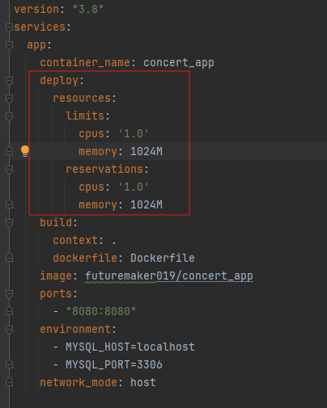
  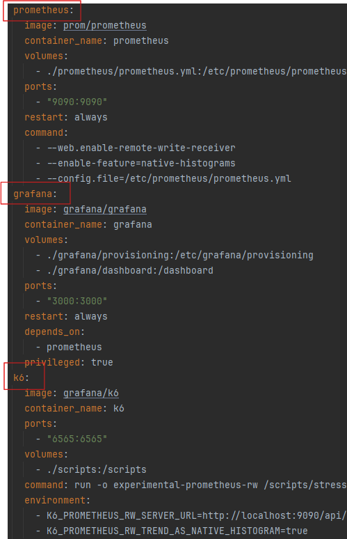
</div>

| 용어           | 설명            | 적용                              | 
|--------------|---------------|---------------------------------|
| reservations | - 최소로 보장하는 자원 | - cpu : 100% <br> - memory: 1G  |
| limits       | 최대 사용 가능한 자원  | - cpu : 100%, <br> - memory: 1G |

> docker container 를 이용하여 테스트할 애플리케이션 서버를 격리하였고 가용한 자원의 영역을 설정하였다.
> 또한 prometheus, grafana를 이용해 k6 부하테스트의 시각화를 하였다.

<br>

#### 시나리오 환경

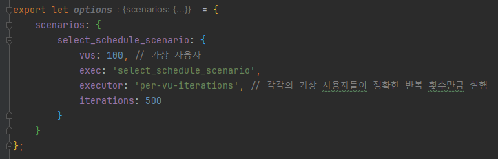

> 가상 사용자는 100명을 기준으로 작성하였으며, 테스트에 따라 iterations를 적절히 수정하여 테스트하였음

</details>


<details>
    <summary style="font-weight: bold">부하테스트 및 결과</summary>

<br>

<details>
    <summary style="font-weight: bold">콘서트 목록조회</summary>

- 문제 확인
  - 콘서트 리스트 조회시 전체 조회로 인해 서버에 많은 부하를 가중시킴

- 테스트 데이터 : 10만개
- 테스트 결과

<div style="display: flex; flex-direction: column; gap: 20px; align-items: center">
  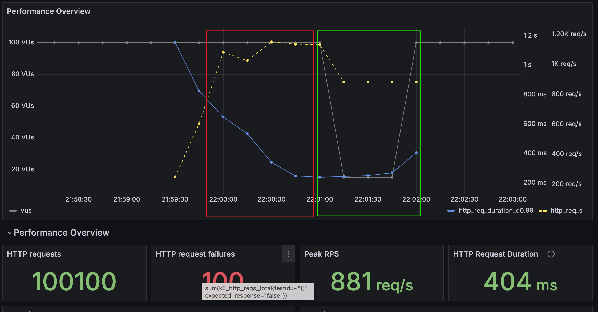
  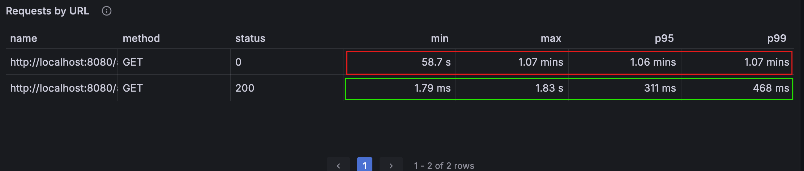
</div>

- 개선
  - 페이지네이션을 추가하여 목록 조회시 속도 개선

| 지표  | 페이지네이션 적용전 | 적용후    | 비고          |
|-----|------------|--------|-------------|
| p95 | 1.06 min   | 311 ms | 99.51% 성능향상 |
| p99 | 1.07 min   | 468 ms | 99.27% 성능향상 |

> 페이지네이션이 적용되지 않은 상태에서 목록 조회시 성능 측정이 불가능하였으며, 페이지네이션 적용 후 많은 개선이 일어났다.
</details>

<br>

<details>
    <summary style="font-weight: bold">콘서트 스케줄의 월별 조회</summary>

- 문제 확인
  - 달력뷰를 위한 콘서트 스케줄의 월별 조회시 인덱스의 부제로 인한 속도 저하
- 데스트 데이터 : 2백만개
- 테스트 결과

<div style="display: flex; flex-direction: column; gap: 20px; align-items: center">
  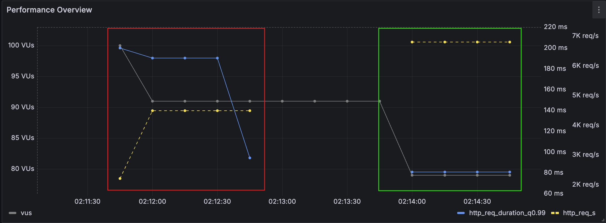
  
  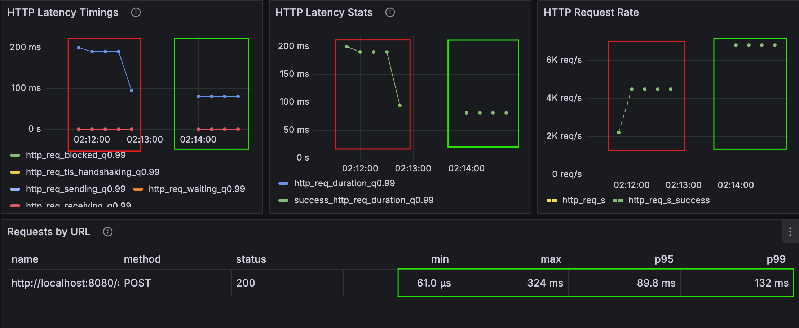
</div>

- 개선
  - concert_id 와 opened_at 을 가지는 복합 인덱스를 적용하여 기능 개선함

| 지표                 |                              | 인덱스 적용전      | 적용후          | 비고            |
|--------------------|------------------------------|--------------|--------------|---------------|
| Iterations         | - 얼마나 많은 "사용자 행동"이 실행되었는지 확인 | - 약 190 ms   | - 75ms       | - 60.53% 성능향상 |
| HTTP Latency Stats | - 요청 지연의 통계 데이터, 서버 성능의 일관성을 분석                             | - 약 190 ms   | - 75ms       | - 60.53% 성능향상 |
| HTTP Request Rate  | - 초당 처리된 HTTP 요청 수, 처리 가능한 최대 요청수 파악이 가능                             | - 약 4k req/s | - 약 7k req/s | - 42.85% 성능향상 |

</details>

<br>

<details>
  <summary style="font-weight: bold">콘서트 스케줄의 좌석 목록조회</summary>

- 문제 확인
  - 콘서트 스케줄의 연관된 좌석을 조회하는 과정에서 좌석의 concert_schedule_id의 인덱스 부제로 인한 조인 속도저하
- 데스트 데이터
  - 콘서트 스케줄 : 10만개
  - seat : 5백만개
- 테스트 결과

<div style="display: flex; flex-direction: column; gap: 20px; align-items: center">
  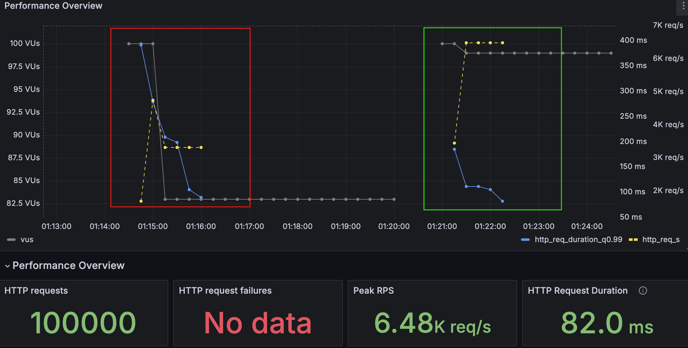
  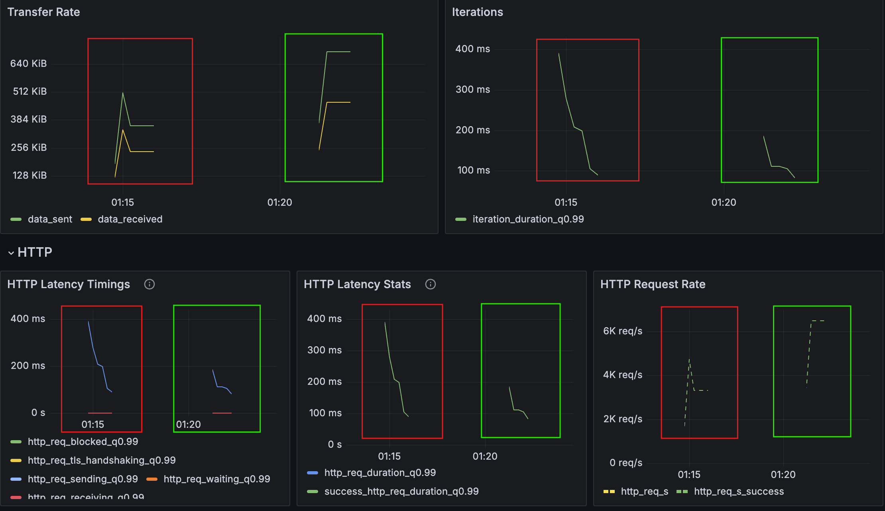
  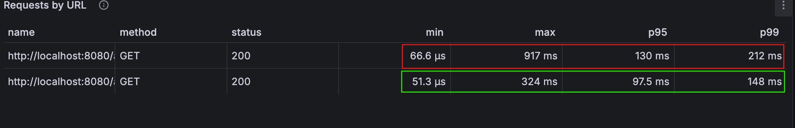
</div>

- 개선
  - Seat의 외례키인 concert_schedule_id 에 인덱스를 적용하여 조인속도 개선

| 지표  | 인덱스 적용전 | 인덱스 적용후 | 비고           |
|-----|---------|---------|--------------|
| p95 | 130 ms  | 97.5 ms | 25% 성능 향상    | 
| p99 | 212 ms  | 148 ms  | 30.19% 성능 향상 | 

</details>

</details>

