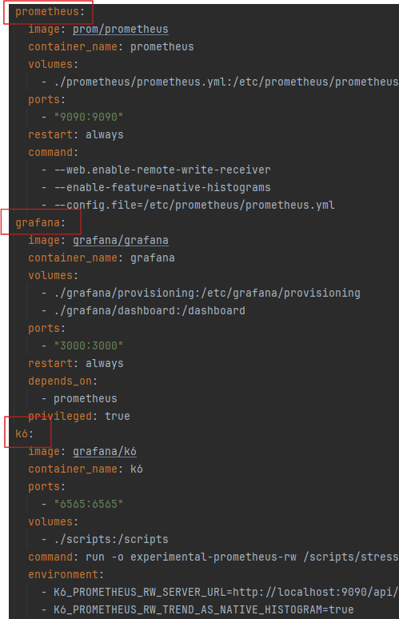
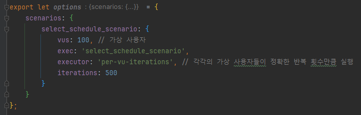
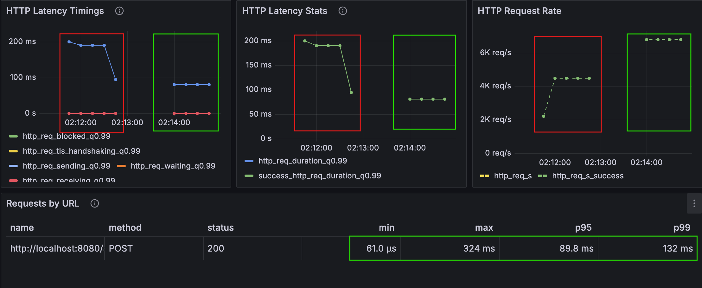
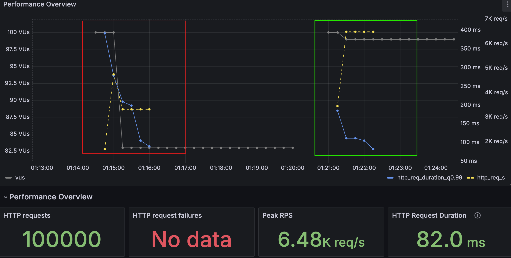

### 부하 테스트

    
목적

> 부하 테스트를 통해 개선이 필요한 API를 선별하여 성능개선을 한다.

 

    
테스트 환경

#### 성능 테스트 환경

| 용어           | 설명            | 적용                              | 
|--------------|---------------|---------------------------------|
| reservations | - 최소로 보장하는 자원 | - cpu : 100%   - memory: 1G  |
| limits       | 최대 사용 가능한 자원  | - cpu : 100%,   - memory: 1G |

> docker container 를 이용하여 테스트할 애플리케이션 서버를 격리하였고 가용한 자원의 영역을 설정하였다.
> 또한 prometheus, grafana를 이용해 k6 부하테스트의 시각화를 하였다.

 

#### 시나리오 환경

> 가상 사용자는 100명을 기준으로 작성하였으며, 테스트에 따라 iterations를 적절히 수정하여 테스트하였음

 

    
부하테스트 및 결과

 

    
콘서트 목록조회

- 문제 확인
    - 콘서트 리스트 조회시 전체 조회로 인해 서버에 많은 부하를 가중시킴

- 테스트 데이터 : 10만개
- 테스트 결과

  
  

- 개선
    - 페이지네이션을 추가하여 목록 조회시 속도 개선

| 지표  | 페이지네이션 적용전 | 적용후    | 비고          |
|-----|------------|--------|-------------|
| p95 | 1.06 min   | 311 ms | 99.51% 성능향상 |
| p99 | 1.07 min   | 468 ms | 99.27% 성능향상 |

> 페이지네이션이 적용되지 않은 상태에서 목록 조회시 성능 측정이 불가능하였으며, 페이지네이션 적용 후 많은 개선이 일어났다.

 

    
콘서트 스케줄의 월별 조회

- 문제 확인
    - 달력뷰를 위한 콘서트 스케줄의 월별 조회시 인덱스의 부제로 인한 속도 저하
- 데스트 데이터 : 2백만개
- 테스트 결과

  
  
  

- 개선
    - concert_id 와 opened_at 을 가지는 복합 인덱스를 적용하여 기능 개선함

| 지표                 |                              | 인덱스 적용전      | 적용후          | 비고            |
|--------------------|------------------------------|--------------|--------------|---------------|
| Iterations         | - 얼마나 많은 "사용자 행동"이 실행되었는지 확인 | - 약 190 ms   | - 75ms       | - 60.53% 성능향상 |
| HTTP Latency Stats | - 요청 지연의 통계 데이터, 서버 성능의 일관성을 분석                             | - 약 190 ms   | - 75ms       | - 60.53% 성능향상 |
| HTTP Request Rate  | - 초당 처리된 HTTP 요청 수, 처리 가능한 최대 요청수 파악이 가능                             | - 약 4k req/s | - 약 7k req/s | - 42.85% 성능향상 |

 

  
콘서트 스케줄의 좌석 목록조회

- 문제 확인
    - 콘서트 스케줄의 연관된 좌석을 조회하는 과정에서 좌석의 concert_schedule_id의 인덱스 부제로 인한 조인 속도저하
- 데스트 데이터
    - 콘서트 스케줄 : 10만개
    - seat : 5백만개
- 테스트 결과

  
  
  

- 개선
    - Seat의 외례키인 concert_schedule_id 에 인덱스를 적용하여 조인속도 개선

| 지표  | 인덱스 적용전 | 인덱스 적용후 | 비고           |
|-----|---------|---------|--------------|
| p95 | 130 ms  | 97.5 ms | 25% 성능 향상    | 
| p99 | 212 ms  | 148 ms  | 30.19% 성능 향상 | 

